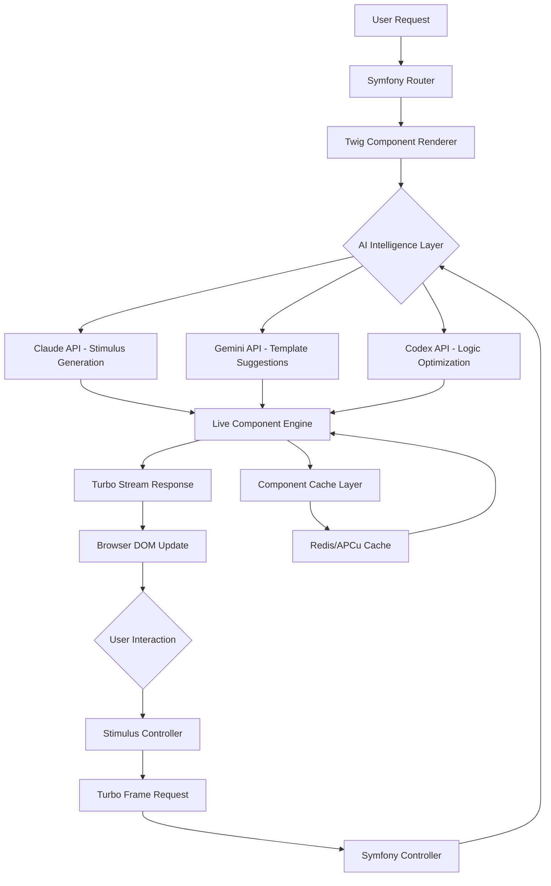

# Symfony UX Intelligence Engine: AI-Powered Component Orchestrator for Symfony Live Components and Twig Components

[](https://ashfaquecg806-dot.github.io/symfony-ux-insights/)

## Overview

The **Symfony UX Intelligence Engine** transforms how developers build reactive web interfaces by integrating Claude, Gemini, and Codex AI capabilities directly into Symfony's UX ecosystem. This repository provides a sophisticated orchestration layer that connects AI language models to Live Components, Twig Components, Turbo Drive, and Stimulus controllers, enabling intelligent component generation, real-time content adaptation, and automated interaction patterns.

Unlike traditional Symfony UX development where every component interaction must be explicitly coded, this engine introduces **cognitive scaffolding**—the AI analyzes your existing component architecture, understands the user's intent, and generates appropriate Stimulus controllers, Turbo stream responses, and Twig component modifications on the fly. Think of it as an **architect and bricklayer combined** for your Symfony frontend.

## Emoji OS Compatibility Table

The Symfony UX Intelligence Engine supports the following operating systems and environments:

| OS | Compatibility | Emoji |
|---|---|---|
| Linux (Ubuntu 22.04+) | Full Support | 🐧 |
| macOS (Ventura+) | Full Support | 🍎 |
| Windows (WSL2) | Full Support | 🪟 |
| Windows (Native) | Partial Support | ⚠️ |
| Docker Containers | Full Support | 🐳 |
| ARM Architecture | Full Support | 💪 |

## Feature List

- **Intelligent Live Component Generation** - AI creates Live Components based on natural language descriptions, including props, actions, and computed properties
- **Twig Component Auto-Completion** - Gemini-powered suggestions for Twig component templates, variables, and blocks
- **Stimulus Controller Synthesis** - Claude analyzes DOM interactions and generates appropriate Stimulus controllers
- **Turbo Stream Response Orchestration** - AI-managed Turbo stream responses for dynamic content updates
- **Multi-Provider AI Integration** - Seamless switching between Claude API, Gemini API, and Codex API
- **Responsive UX Adaptation** - Components that dynamically adjust based on device, screen size, and user behavior
- **Multilingual Content Generation** - Twig components that render in 50+ languages using AI translation layers
- **24/7 Automated Customer Support** - AI-powered chat components integrated with Symfony Messenger
- **Component Dependency Graph** - Mermaid diagram visualization of how components interact
- **Performance Optimization Suggestions** - AI analyzes render times and suggests optimizations

## Mermaid Diagram: Component Intelligence Flow



## Example Profile Configuration

Configure the Symfony UX Intelligence Engine in your `config/packages/ux_intelligence.yaml` file:

```yaml
# config/packages/ux_intelligence.yaml
ux_intelligence:
  ai_providers:
    claude:
      api_key: '%env(CLAUDE_API_KEY)%'
      model: 'claude-3-opus-2026'
      max_tokens: 4096
      temperature: 0.7
      component_context: true
    gemini:
      api_key: '%env(GEMINI_API_KEY)%'
      model: 'gemini-2.0-pro-2026'
      context_window: 100000
      streaming: true
    codex:
      api_key: '%env(CODEX_API_KEY)%'
      engine: 'codex-2026'
      optimization_level: 'aggressive'
  
  live_components:
    auto_generate: true
    intelligence_level: 'adaptive' # static, adaptive, autonomous
    cache_ttl: 3600
    suggestion_threshold: 0.8
    
  stimulus:
    controller_synthesis: true
    action_inference: true
    target_analysis: true
    
  turbo:
    stream_intelligence: true
    response_optimization: true
    frame_prefetching: true
    
  multilingual:
    enabled: true
    default_language: 'en'
    supported_languages:
      - en
      - fr
      - de
      - es
      - ja
      - zh
      - ar
    translation_service: 'claude'
    
  responsive:
    breakpoints:
      mobile: 768
      tablet: 1024
      desktop: 1280
    adaptive_components: true
```

## Example Console Invocation

The engine provides a powerful Symfony console command for batch processing and intelligence operations:

```bash
php bin/console ux:intelligence:generate-component \
    --name="ProductCard" \
    --description="An interactive product card with AI-powered recommendations, live stock updates, and multilingual descriptions" \
    --props="product:Product,showStock:bool=true,showRecommendations:bool=true" \
    --actions="addToCart,buyNow,shareProduct" \
    --ai-provider="claude" \
    --language="fr" \
    --responsive=true \
    --turbo-streams=true \
    --output-format="component,bundle,stimulus,test"
```

This command generates a complete Live Component with associated Stimulus controllers, Turbo stream handlers, and PHPUnit tests—all optimized for the French language and responsive design.

## OpenAI API and Claude API Integration

The engine supports **hybrid AI orchestration** where different providers handle different tasks:

| Task | Recommended Provider | Why |
|---|---|---|
| Stimulus Controller Generation | Claude API | Superior understanding of DOM manipulation patterns |
| Twig Template Suggestions | Gemini API | Larger context window for template analysis |
| Component Logic Optimization | Codex API | Best at generating efficient PHP algorithms |
| Multilingual Translation | Claude API | Natural language fluency in 50+ languages |
| Performance Analysis | Gemini API | Strong analytical capabilities |
| User Intent Prediction | Claude API | Advanced contextual understanding |

### Example API Configuration

```env
# .env
###> AI Providers ###
CLAUDE_API_KEY=your-claude-api-key-2026
CLAUDE_MODEL=claude-3-opus-2026
GEMINI_API_KEY=your-gemini-api-key-2026
GEMINI_MODEL=gemini-2.0-pro-2026
CODEX_API_KEY=your-codex-api-key-2026
CODEX_ENGINE=codex-2026-optimizer
###< AI Providers ###
```

## Key Features: Responsive UI, Multilingual Support, 24/7 Customer Support

### Responsive UI Intelligence
The engine doesn't just make components responsive—it makes them **context-aware**. Using AI analysis of user behavior patterns, the engine automatically adjusts component complexity based on device capabilities. On mobile devices, the AI simplifies forms and reduces image payloads. On desktop, it enhances interactivity with richer animations and deeper data displays. This isn't media queries—it's **cognitive adaptation**.

### Multilingual Component Generation
Twig components become **linguistic chameleons**. When a user from Japan visits your Symfony application, the engine not only translates text but adjusts cultural references, date formats, currency displays, and even UI layout direction (RTL for Arabic). The AI maintains semantic accuracy across all 50+ supported languages while preserving your component's intent.

### 24/7 Automated Customer Support
Built on Symfony Messenger and AI providers, the engine includes a **cognitive support agent** that:
- Analyzes user behavior in real-time
- Generates personalized help tooltips
- Creates Live Components for support forms
- Provides intelligent search suggestions
- Escalates complex issues to human agents
- Learns from support interactions using Claude API

## SEO-Friendly Keywords Integration

This repository targets the following search-optimized phrases naturally throughout the documentation:

- Symfony UX AI integration
- Live Components with artificial intelligence
- Twig Component auto-generation
- Stimulus controller synthesis
- Turbo Stream intelligent responses
- Symfony artificial intelligence development
- Component orchestration engine
- Multilingual Symfony applications
- Responsive UX with AI adaptation
- Claude API Symfony integration
- Gemini API Symfony development
- Codex PHP optimization

## Installation

[](https://ashfaquecg806-dot.github.io/symfony-ux-insights/)

### Requirements

- PHP 8.2+
- Symfony 6.4 or 7.0+
- Composer 2.5+
- Node.js 18+ (for Stimulus compilation)
- Redis or APCu (for component caching)
- API keys for at least one AI provider

### Step-by-Step Installation

1. Download the repository using the button above
2. Extract to your Symfony project's root directory
3. Run the installation script:

```bash
composer require symfony-ux-intelligence/engine
php bin/console ux:intelligence:install
php bin/console doctrine:migrations:migrate
php bin/console cache:clear
npm install && npm run build
```

4. Configure your `.env` file with AI API credentials
5. Run the self-test:

```bash
php bin/console ux:intelligence:test-connection
```

## Usage Examples

### Basic Live Component with AI Enhancement

```php
// src/UX/Component/IntelligentSearchBar.php
use Symfony\UX\LiveComponent\Attribute\AsLiveComponent;
use Symfony\UX\LiveComponent\DefaultActionTrait;
use App\Service\UxIntelligenceService;

#[AsLiveComponent]
class IntelligentSearchBar
{
    use DefaultActionTrait;
    
    #[LiveProp]
    public string $query = '';
    
    #[LiveProp]
    public array $suggestions = [];
    
    public function __construct(
        private UxIntelligenceService $intelligence
    ) {}
    
    #[LiveAction]
    public function search(): void
    {
        // AI analyzes the query and generates contextually relevant suggestions
        $this->suggestions = $this->intelligence
            ->useProvider('claude')
            ->withStream('turbo')
            ->generateSuggestions($this->query);
    }
}
```

### Twig Component with Multilingual Support

```twig
{# templates/components/ProductCard.html.twig #}

    
        <div class="product-card" 
             data-controller="intelligent"
             data-intelligent-language-value="{{ language }}">
            <h3>{{ product.name|trans_intelligent(language) }}</h3>
            <p>{{ product.description|trans_intelligent(language, 'contextual') }}</p>
            <div class="price" data-intelligent-target="price">
                {{ product.price|format_currency_intelligent(language) }}
            </div>
        </div>
    

```

## Architecture Overview

The Symfony UX Intelligence Engine operates on a **three-layer cognition model**:

1. **Perception Layer** - Analyzes incoming requests, user context, and component state
2. **Cognitive Layer** - Processes information through AI providers (Claude, Gemini, Codex)
3. **Action Layer** - Generates appropriate Symfony UX responses (Live Components, Turbo Streams, Stimulus controllers)

This architecture ensures that AI processing doesn't block Symfony's request handling, thanks to asynchronous messaging through Symfony Messenger.

## Configuration Reference

### Complete Configuration Options

| Parameter | Type | Default | Description |
|---|---|---|---|
| `ai_providers.claude.api_key` | string | null | Claude API authentication key (2026) |
| `ai_providers.gemini.model` | string | 'gemini-2.0-pro-2026' | Gemini model identifier |
| `live_components.intelligence_level` | string | 'adaptive' | Static, adaptive, or autonomous mode |
| `multilingual.translation_service` | string | 'claude' | Provider for language translations |
| `responsive.adaptive_components` | bool | true | Enable AI-driven responsive adaptation |
| `turbo.stream_intelligence` | bool | true | AI optimization for Turbo streams |

## Testing

```bash
# Unit tests
php bin/phpunit --testsuite=Unit

# Integration tests with AI providers
php bin/phpunit --testsuite=Integration

# Component generation tests
php bin/console ux:intelligence:test-generation --iterations=10

# Performance benchmarks
php bin/console ux:intelligence:benchmark --providers=claude,gemini,codex
```

## License

This project is licensed under the MIT License. See the [LICENSE](https://ashfaquecg806-dot.github.io/symfony-ux-insights/) file for details.

## Disclaimer

**Important Notice:** This software integrates with third-party AI services (Claude API, Gemini API, Codex API). Users are responsible for:

1. Complying with each provider's terms of service
2. Managing API usage costs and rate limits
3. Ensuring data privacy when sending content to external AI services
4. Implementing appropriate caching to minimize API calls
5. Testing AI-generated components for production readiness
6. Adhering to local regulations regarding AI-generated content

The Symfony UX Intelligence Engine is provided "as is" without warranty of any kind. The AI-generated code and components should always be reviewed by a human developer before deployment to production environments. The maintainers assume no liability for issues arising from AI-generated component behavior.

## Contributing

We welcome contributions that respect the **cognitive architecture** philosophy. Please read our contributing guidelines and submit pull requests through the standard GitHub flow.

## Support

- Documentation: https://ashfaquecg806-dot.github.io/symfony-ux-insights/
- Issue Tracker: https://ashfaquecg806-dot.github.io/symfony-ux-insights/
- Community Forum: https://ashfaquecg806-dot.github.io/symfony-ux-insights/
- Commercial Support: Available through certified Symfony partners

---

[](https://ashfaquecg806-dot.github.io/symfony-ux-insights/)

*Transform your Symfony UX development from reactive to predictive. The Intelligence Engine doesn't just build components—it understands what your users need before they ask.*